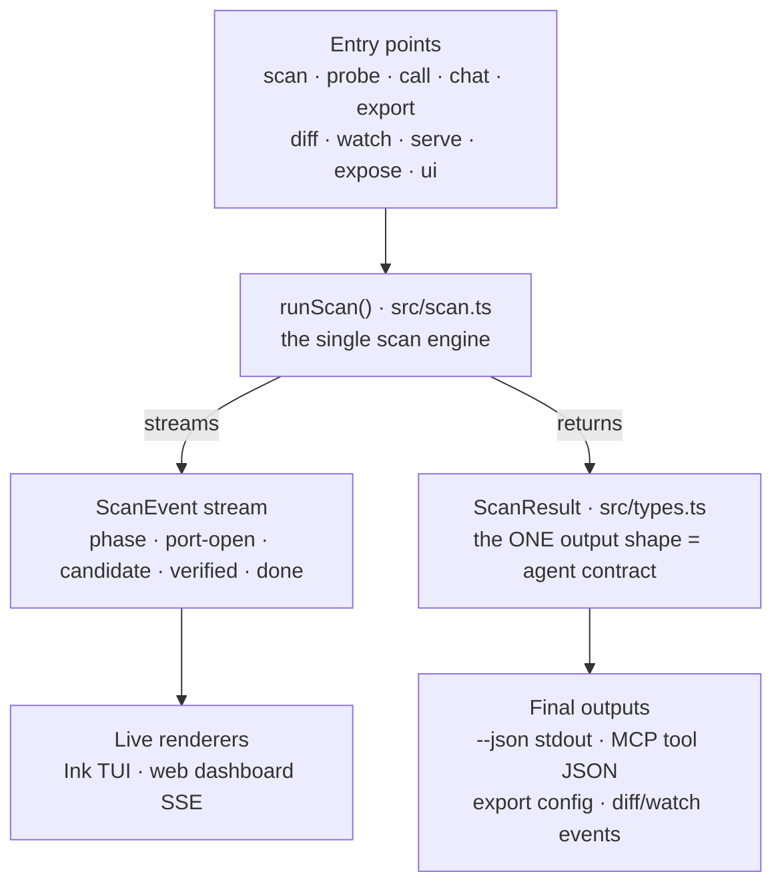
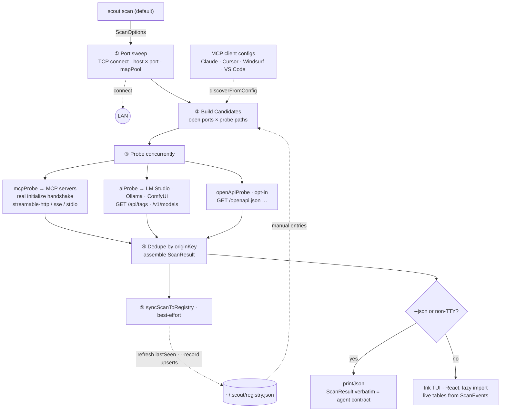
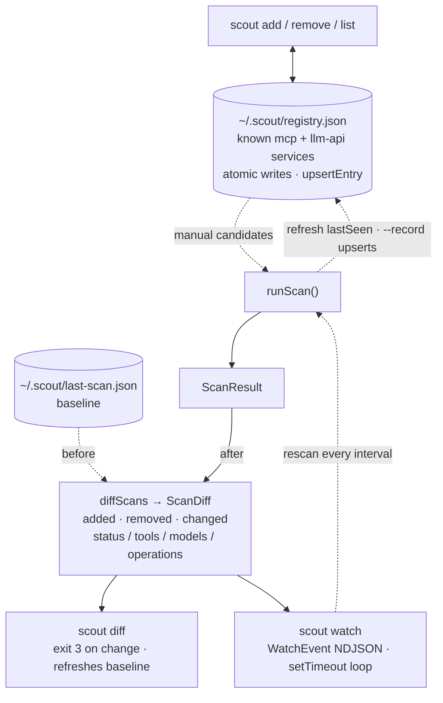
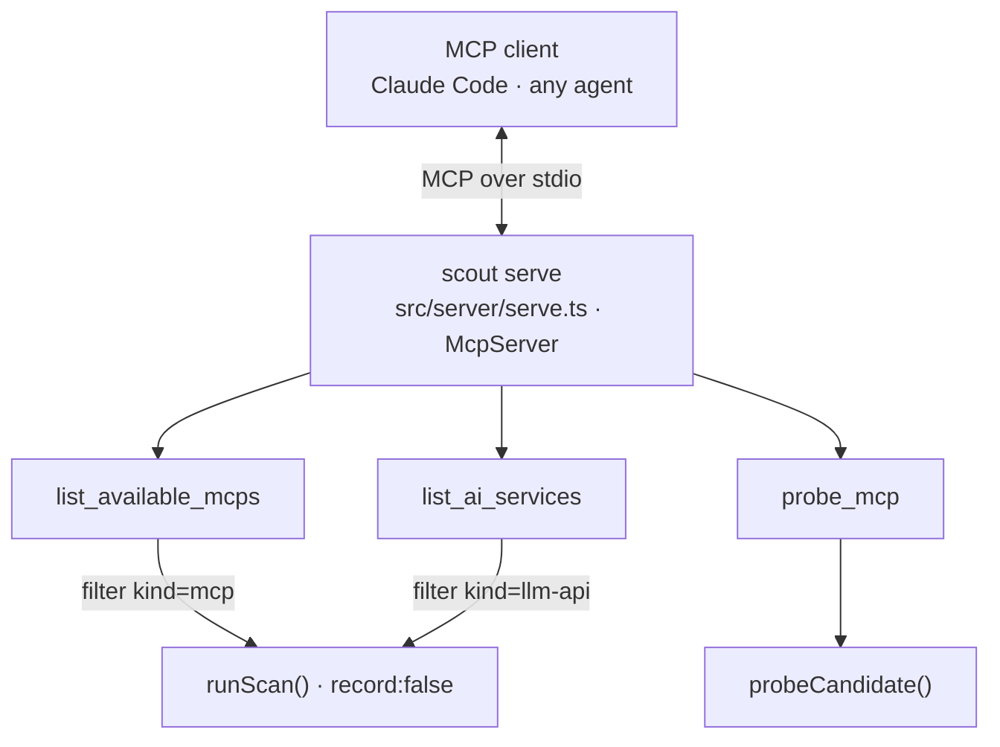
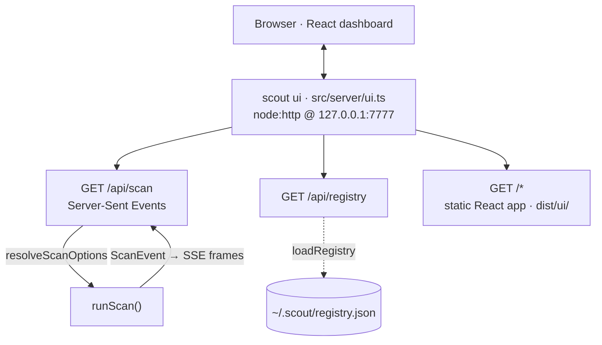
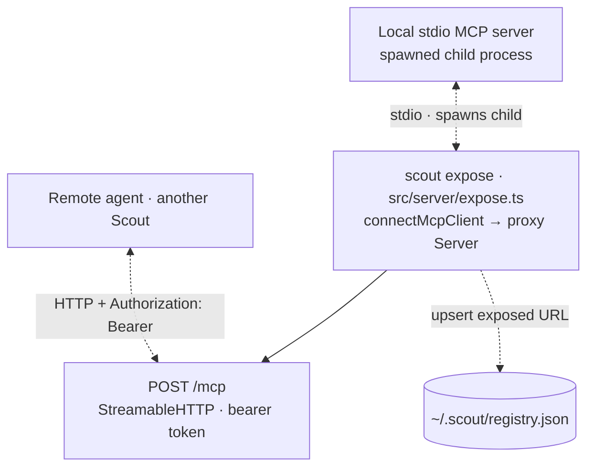
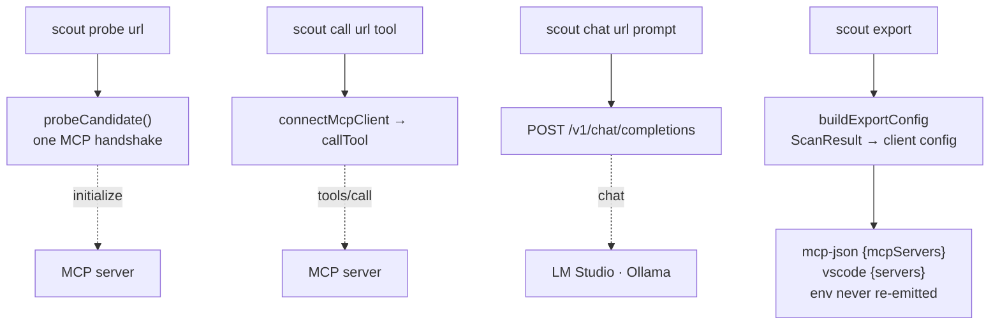

# Scout — Architecture

One scan engine, one output contract: every discovery path in Scout funnels
through `runScan()` in [`src/scan.ts`](../src/scan.ts), which emits a stream of
`ScanEvent`s and returns exactly one shape — `ScanResult`
([`src/types.ts`](../src/types.ts)). `--json` prints that object verbatim (the
agent contract); the Ink TUI, the web dashboard, and `scout serve` are just
different renderers of the same engine.

The architecture is split into focused views below. In every diagram,
**solid arrows** are in-process calls / data flow and **dotted arrows** are I/O
crossing a boundary (network requests, file reads/writes, spawned processes).

---

## 1. The big picture

Everything flows through one engine. Commands and servers on top, the engine in
the middle, renderers and outputs at the bottom.

Targeting flags change *which* services are found; display flags only affect
the human UI. Neither may ever change the shape of `ScanResult`.

---

## 2. `scout scan` — the discovery pipeline

The default command. Five phases, streaming `ScanEvent`s throughout. Only
`available` and `auth-required` services are ever emitted — everything else
(open-but-not-MCP, declared-but-dead) is discarded.

Verification rules: an MCP service must complete a real `initialize`
handshake; `auth-required` needs the strict signal HTTP 401 **plus** a
`WWW-Authenticate` header. On an `originKey` collision the better result wins
(available beats auth-required, then lower latency), and an `openapi` result is
dropped when an MCP/AI service already claimed the same host.

---

## 3. Registry, diff & watch

Persistent memory lives in `~/.scout/` (override with `$SCOUT_HOME`). Manual
registry entries feed back into every scan as candidates; `diff` and `watch`
compare scans keyed by `originKey`.

---

## 4. `scout serve` — Scout *as* an MCP server

Runs over stdio so any MCP client can use discovery as tools. Read-only:
`record` is forced off so a discovery call never mutates the registry.

---

## 5. `scout ui` — the web dashboard

A `node:http` server on `127.0.0.1:7777` serving the built React app plus a
live scan over Server-Sent Events. No React runtime is loaded on the CLI's
agent path — the dashboard is its own bundle in `dist/ui/`.

---

## 6. `scout expose` — stdio → HTTP bridge

Publishes a local stdio-only MCP server onto the network. Guarded by a bearer
token whose `401 + WWW-Authenticate` response is exactly the strict signal
another Scout reads as `auth-required` — so remote scouts discover it cleanly.

---

## 7. One-shot commands — probe & invoke

Beyond scanning, Scout verifies and *invokes* individual services. These skip
discovery and act on one explicit URL.

---

## Shared seams

A few modules exist specifically to keep the entry points from drifting:

- **[`src/defaults.ts`](../src/defaults.ts)** — engine defaults shared by the
  CLI flags and the `serve` tool arguments.
- **[`src/util/scanOptions.ts`](../src/util/scanOptions.ts)** —
  `resolveScanOptions()`, the one place raw inputs become a full `ScanOptions`;
  used by both the CLI and the UI server.
- **[`src/util/originKey.ts`](../src/util/originKey.ts)** — the single service
  identity scheme (`mcp:stdio:<label>` or `<kind>:<host:port>`) used by scan
  dedupe, the registry, and diffing.
- **[`src/probe/mcpProbe.ts`](../src/probe/mcpProbe.ts)** `connectMcpClient()` —
  shared by probing, `call`, and `expose`.
